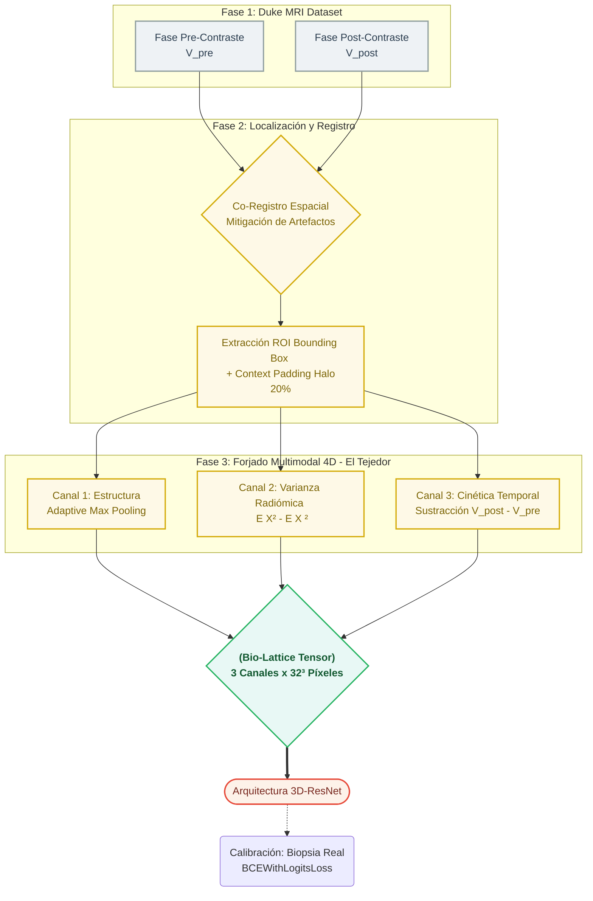

# microCube (Bio-Lattice)

Converts raw breast MRI volumes (DICOM) into highly compact **32×32×32 4D micro-cubes** with **3 independent channels** (structural foundation, 3D texture variance/GLCM, and pre/post contrast kinetics). Currently, this codebase trains a custom **3D-ResNet neural network** over these tensors for a specialized clinical binary classification task: **Benign vs. Malignant**. 

The micro-cube itself is a powerful **input representation**: with different clinical labels and a modified classification head (e.g., multi-class molecular subtypes), it could be adapted to other diagnostic tasks, subject to cohort size and data availability.

## Requirements

- Python 3.10+ (The project locally uses Python 3.13)
- Duke Cohort type data: `datasets/raw_data/<PatientID>/...`, `datasets/Annotation_Boxes.xlsx`, `datasets/Clinical_and_Other_Features.xlsx`

## Installation

```bash
python -m venv .venv
source .venv/bin/activate   # Windows: .venv\Scripts\activate
pip install -r requirements.txt
```

PyTorch: If you need a specific hardware variant (CPU/CUDA), follow the [official installation guide](https://pytorch.org/get-started/locally/).

## Usage (Core Pipeline)

1. **`python main.py`** — Parses DICOMs, crops the target Region of Interest (with padding), and serializes `.pt` tensors into `datasets/micro_cubos/`.



2. **`python train.py`** — Trains the `RedMicroCubo3Ch` residual classifier natively and saves the optimal model weights to `datasets/modelo/biolattice_3dresnet_binary.pth`.
3. **`python predict.py`** — Performs Virtual Biopsy inference for a specific `Patient ID`.
4. **`streamlit run dashboard/app.py`** — Launches the interactive UI orchestrator to handle the full pipeline and dataset evaluations visually.

## Additional Details

In **`docs/`** you'll find the technical pipeline documentation and business validation notes. **`visualizer.py`** provides utilities to inspect the geometry of a generated cube. **`backup/`** keeps legacy script versions.

## Medical Disclaimer

This is strictly a **Research Prototype**, not a certified medical device. Do not use for final clinical decisions or standalone patient diagnosis.
