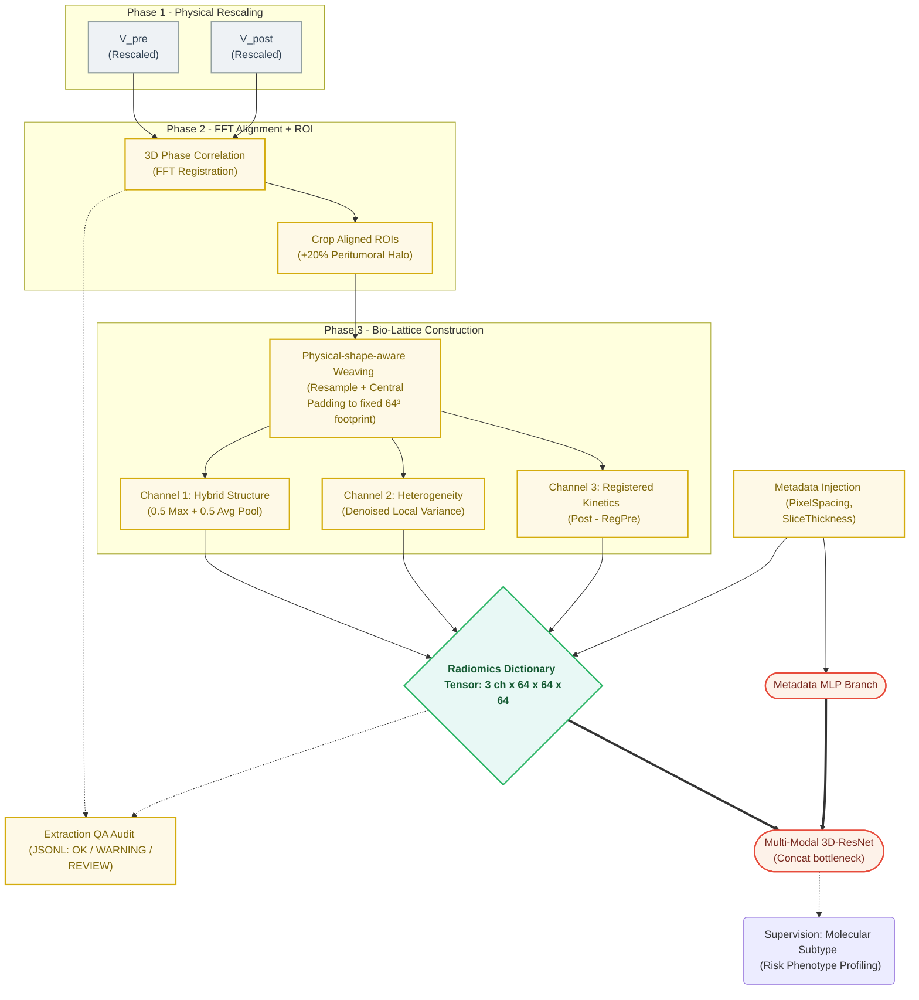

# microCube (Bio-Lattice) - v2

[](https://github.com/msancheza/biolattice/releases/latest)
[](https://github.com/msancheza/biolattice/blob/main/LICENSE)
[](https://www.python.org/)

Converts raw breast MRI volumes (DICOM) into highly compact **64×64×64** tensors packed within a **Radiomics Dictionary** containing physical metadata. The tensor features **3 channels**: post-contrast **hybrid structure** (0.5 Max + 0.5 Avg), **denoised heterogeneity** (pooled variance after Gaussian blur), and **registered kinetics** (FFT-aligned post − pre). 

## Current Version

- **v2 (Bio-Lattice):** Active default version focused on **Virtual Risk Phenotype Biopsy** from compact DICOM-derived fingerprints (`tensor [3, 64, 64, 64]` + physical metadata), with extraction QA audits (`OK` / `WARNING` / `REVIEW`) and dashboard orchestration.

## Version History

| Version | Status | Description |
|---------|--------|-------------|
| **v1** | Released | Initial operational baseline of the pipeline, used for the first public release before the v2 promotion. |
| **v2** | Current | Consolidates the current project objective: Green-AI micro-cube distillation, FFT-based pre/post alignment, multi-modal training (tensor + metadata), and extraction quality-gate auditing. |

### 🧬 From Detection to Phenotyping (Expectation vs. Reality)

*   **Initial Expectation:** Develop a universal binary classifier for Benign vs. Malignant lesions.
*   **Data Reality:** The reference dataset (Duke Breast MRI) is an oncological cohort of patients with confirmed cancer. Training a model to "detect" cancer in a database where everyone already has it is not viable.
*   **Strategic Pivot:** We have evolved Bio-Lattice toward **Virtual Risk Phenotype Biopsy**. The system does not predict the presence of cancer, but rather estimates the **tumor risk phenotype**, aligning its predictions with the **Molecular Subtype** reported by pathology as our primary reference base.
*   **Scalability:** With the inclusion of datasets containing concurrent benign cases, this same architecture can easily scale to a full triage system. Currently, it specializes in the most complex clinical task: predicting the internal biology of the tumor from imaging.

### Technical Improvements (v2)

| Module | Phase | Improvement |
|--------|-------|-------------|
| **Extraction** | Physicality | Applied **Rescale Slope/Intercept** for inter-scanner compatibility. |
| **Registration** | Geometry | Added **3D Phase Correlation (FFT)** with **SciPy Affine Shifting** for robust, non-circular rigid translation. |
| **QA Gate** | Confidence | Added **Correlation Check** post-registration to flag high-motion cases. |
| **Weave** | Signal | **Hybrid Channel 1** (Avg + Max) to capture mass and peak intensity. |
| **Texture** | Noise | **Gaussian Denoising** applied before local variance calculation. |
| **Metadata** | Radiomics | **PixelSpacing & SliceThickness** extracted to feed the auxiliary branch of our **Multi-Modal neural network**. |

### Training labels (Ground Truth)

Training and evaluation use the **`Mol Subtype`** column from the Duke clinical file. This label is a real laboratory result, not an estimation.

| Code label | Rule in `train.py` | Meaning |
|------------|-------------------|---------|
| **0** | `Mol Subtype = 0` | **Lower Risk** (Luminal A) |
| **1** | `Mol Subtype > 0` | **High Risk** (Luminal B, HER2+, Triple Negative) |

Training uses **Focal Loss** (tune α / γ in `config.py`) to emphasize **hard examples**, plus **Mish** and **BatchNorm1d** in the head. The image embedding is concatenated with a small **MLP** on **spacing + slice thickness** (see `train.py`).

Metrics reflect how well the **multi-modal** head separates classes under the **`Mol Subtype`** rule — not a universal pathology gold standard.

## 🌱 Green AI & Computational Efficiency

Instead of training massive, energy-hungry 3D Convolutional Networks directly on gigabyte-scale DICOMs, Bio-Lattice mathematically condenses clinical data into microscopic 4D tensors *prior* to deep learning. This allows the core 3D-ResNet to train natively on consumer-grade hardware (e.g., Apple Silicon) in minutes rather than days on cloud GPUs. This architecture drastically reduces the operational carbon footprint and cloud computing costs, democratizing high-tier medical research without sacrificing diagnostic sensitivity.

## Requirements

- Python 3.10+ (The project locally uses Python 3.13)
- Duke Cohort type data: `datasets/raw_data/<PatientID>/...`, `datasets/Annotation_Boxes.xlsx`, `datasets/Clinical_and_Other_Features.xlsx`

**Configuration:** Paths, Duke series keywords, training hyperparameters, inference threshold, and model widths live in **`config.py`**. Adjust that file instead of scattering magic numbers across `main.py` / `train.py` / `predict.py`.

## Installation

```bash
python -m venv .venv
source .venv/bin/activate   # Windows: .venv\Scripts\activate
pip install -r requirements.txt
```

PyTorch: If you need a specific hardware variant (CPU/CUDA), follow the [official installation guide](https://pytorch.org/get-started/locally/).

## Dataset & Reproducibility (Duke Breast Cancer MRI)

For testing was used the public **Duke Breast Cancer MRI dataset** from The Cancer Imaging Archive (TCIA). 

Since raw DICOM MRI sequences and the generated 4D tensors weigh hundreds of gigabytes, **they are not included in this code repository** to ensure lightning-fast cloning. 

* **Pre-compiled tensors (third party):** **[Hugging Face Datasets](https://huggingface.co/datasets/msancheza/microCube-Duke-Breast-MRI)** may ship an older layout (e.g. 32³, different folder naming). For **v2**, prefer tensors you generate with this repo’s `main.py` so shape (**64³**), `meta`, and paths match `config.PATH_MICRO_CUBES`.
* **Quick test (examples):** If you keep example `.pt` files under `datasets/examples_microcubos/`, copy compatible tensors into **`datasets/micro_cubes/`** (see `PATH_MICRO_CUBES` in `config.py`) before `predict.py` or the Streamlit app — only works if the file format matches v2 (dict with `tensor` + `meta`).
* **Full reproduction:** Download the Duke cohort from TCIA, place DICOMs under `datasets/raw_data/<PatientID>/`, and run **`python main.py`** from the **`v2/`** tree to write `*_lattice.pt` files into `datasets/micro_cubes/`.

## Usage (v2 Pipeline)

1. **`python main.py`** (from **`v2/`**) — Writes `<PatientID>_lattice.pt` under **`datasets/micro_cubes/`** (see `PATH_MICRO_CUBES`).

### Extraction quality gate (operational)

`main.py` also writes a per-run extraction audit (`JSONL`) under `dashboard/extraction_audits/` with one record per patient (`OK` / `WARNING` / `REVIEW`).
These logs are not training telemetry; they are a data-quality gate for the DICOM-to-microcube fingerprint (pairing, registration confidence, metadata sanity) before training/inference.

### What `main.py` actually does (v2)

| Step | Reality |
|------|--------|
| **Series choice** | Walks folders and picks **pre** vs **post** with **substring rules** tuned to Duke naming. |
| **3D stack** | Slices sorted by **`ImagePositionPatient[2]`**. **`RescaleSlope` / `RescaleIntercept`** are applied to ensure physical pixel values. |
| **Registration** | **FFT phase correlation** estimates translation; **SciPy** applies a **non-circular** shift of the pre volume. QA uses **Pearson r** between aligned pre and post; warn if below **`REGISTRATION_MIN_CORRELATION`** (default **0.80** in `config.py`). |
| **ROI** | Box from **`Annotation_Boxes.xlsx`**. Extracted from aligned volumes with 20% peritumoral padding. |
| **Output** | A **Dictionary Object** containing `meta` (PixelSpacing, SliceThickness) and the `tensor` **`[3, 64, 64, 64]`**. |


```mermaid
graph TD
    %% Global Styles
    classDef raw fill:#eef2f5,stroke:#93a1a1,stroke-width:2px,color:#2c3e50;
    classDef process fill:#fef9e7,stroke:#d4ac0d,stroke-width:2px,color:#7d6608;
    classDef tensor fill:#e8f8f5,stroke:#28b463,stroke-width:2px,color:#145a32,font-weight:bold;
    classDef net fill:#fdf2e9,stroke:#e74c3c,stroke-width:2px,color:#78281f;

    %% 1. Raw DICOM Sequences
    subgraph phase1 ["Phase 1 - Physical Rescaling"]
        PRE["V_pre <br/> (Rescaled)"]:::raw
        POST["V_post <br/> (Rescaled)"]:::raw
    end

    %% 2. Registration + ROI
    subgraph phase2 ["Phase 2 - FFT Alignment + ROI"]
        REG["3D Phase Correlation <br/> (FFT Registration)"]:::process
        ROI["Crop Aligned ROIs <br/> (+20% Peritumoral Halo)"]:::process
    end

    PRE --> REG
    POST --> REG
    REG --> ROI

    %% 3. The Tensor Weaver
    subgraph phase3 ["Phase 3 - Bio-Lattice Construction"]
        ISO["Physical-shape-aware Weaving <br/> (Resample + Central Padding to fixed 64³ footprint)"]:::process
        C1["Channel 1: Hybrid Structure <br/> (0.5 Max + 0.5 Avg Pool)"]:::process
        C2["Channel 2: Heterogeneity <br/> (Denoised Local Variance)"]:::process
        C3["Channel 3: Registered Kinetics <br/> (Post - RegPre)"]:::process
    end

    ROI --> ISO
    ISO --> C1
    ISO --> C2
    ISO --> C3

    %% 4. Final Output
    META["Metadata Injection <br/> (PixelSpacing, SliceThickness)"]:::process
    CUB{"Radiomics Dictionary <br/> Tensor: 3 ch x 64 x 64 x 64"}:::tensor
    QA["Extraction QA Audit <br/> (JSONL: OK / WARNING / REVIEW)"]:::process
    C1 --> CUB
    C2 --> CUB
    C3 --> CUB
    META --> CUB
    REG -.-> QA
    CUB -.-> QA

    %% 5. Downstream Inference
    MLP(["Metadata MLP Branch"]):::net
    RES(["Multi-Modal 3D-ResNet <br/> (Concat bottleneck)"]):::net
    LOSS("Supervision: Molecular Subtype <br/> (Risk Phenotype Profiling)")

    CUB ==> RES
    META --> MLP
    MLP ==> RES
    RES -.-> LOSS
```

2. **`python train.py`** — Trains the `BioLattice3DResNet` residual classifier natively and saves the optimal model weights to `datasets/modelo/biolattice_3dresnet_binary.pth`.
3. **`python predict.py`** — Interactive inference for one `Patient ID`. Programmatic callers get a dict with English keys, e.g. `aggressiveness_percent` (risk index), `high_risk`, `threshold_percent`; `evaluate_dataset()` returns `sensitivity`, `specificity`, `confusion`, `configured_threshold`, etc.
4. **`streamlit run dashboard/app.py`** (from **`v2/`**) — Launches the UI orchestrator for extraction, training, validation, and inference.

## Why this direction matters (potential & iteration)

The **core bet** of Bio-Lattice is to **separate** two problems: (1) turning large, multi-phase breast MRI into a **small, task-aware tensor** that still carries structure, heterogeneity, and enhancement dynamics, and (2) training a **light** 3D model that can iterate quickly on consumer hardware. That split keeps the research loop cheap: you can revisit labels, augmentations, or heads without always paying for full-volume training.

The repo today incorporates advanced robust techniques (FFT rigid registration, higher resolution 64³ matrices, Subtype Ground Truths, and Focal Loss), but remains a focused prototype. **Improving each phase over time** is the main lever to strengthen the project—not rewriting everything at once, but tightening the weakest link (Bio-Lattice v3.0 ideas):

| Area | How further work could help |
|------|-----------------------------|
| **Registration & Geometry** | Upgrading from rigid FFT Phase Correlation to **Sub-pixel or Deformable Registration** (handling respiratory motion) would drastically eliminate artifact noise in the kinetics channel. |
| **Radiomics Geometry** | **Migrating from "fake isotropy" (AdaptiveMaxPool)**: Early versions and v2 rely on computational pooling to force highly varied tumor ROIs into a uniform 64³ mathematical cube, at the cost of distorting real-world physical geometry. In future iterations, we move toward explicit structural resampling: actively using our DICOM *Radiomics Dictionary* (PixelSpacing, SliceThickness) to perform true mathematical voxel‑isotropic resampling (e.g. via Splines) **before** the data reaches the neural network. This preserves strict absolute spatial relationships while still delivering the standardized tensor footprint critical for our Green AI rapid training loop. |
| **Weave design** | Injecting raw T1w/T2w context channels or creating dynamic Temporal channels based on the explicit `AcquisitionTime` temporal delta. |
| **Labels & evaluation** | Pathology-aligned targets, external validation, and patient-level splits documented in the repo would align claims with clinical meaning. |
| **Training** | Architecture search, calibration of thresholds, or uncertainty estimates could sit on top of the same tensors without changing the green-AI story. |

None of that is required to **run or extend** this prototype; it is a **roadmap-shaped** note so contributors know where effort pays off next.

## Research Impact / Potential Applications

This v2 pipeline is intended as a **translational research scaffold** rather than a one-off benchmark script. For reviewers and clinical collaborators, its practical value is the separation between imaging engineering and downstream prediction, which makes retrospective and prospective studies easier to iterate.

- **Phenotype-oriented imaging biomarker studies:** the current target (`Mol Subtype` binarization) can be replaced with institution-approved endpoints (e.g., receptor status groups, grade, treatment response) while preserving the same extraction and model skeleton.
- **Low-cost multicenter prototyping:** the compact 64³ representation enables cross-site pilots without repeatedly training on full native volumes, reducing compute and collaboration friction.
- **Structured, interpretable ablations:** because channels encode explicit structure / heterogeneity / kinetics priors, collaborators can run controlled ablations (channel drop, resolution changes, metadata branch on/off) and map changes to clinical hypotheses.
- **Bridge to richer decision-support tasks:** with appropriate labels and governance, the same framework can evolve toward neoadjuvant response modeling, risk stratification workflows, or multimodal fusion studies.

To keep claims clinically meaningful, external validation, patient-level split governance, and endpoint definitions should remain explicit in any study built on top of this repo.

## Medical Disclaimer

<div align="center">
🔬 **Research Prototype Only** — Not for clinical use
</div>
